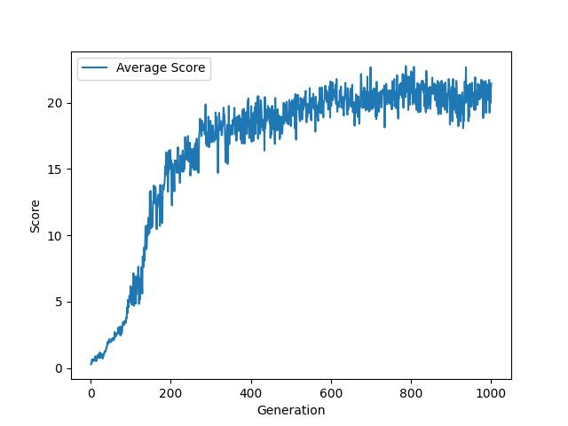
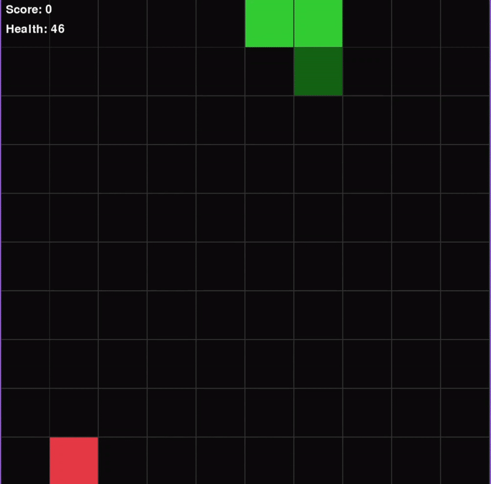
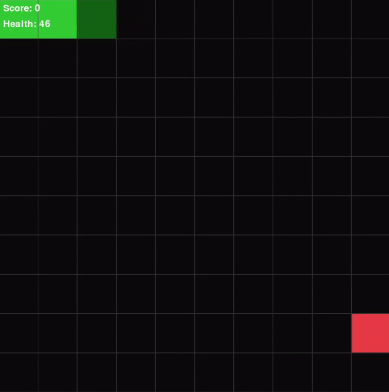

# SnakeV1

### MLP Input
The input neurons are binary. \
In each of the 8 directions from the head, we will find:
- if the wall is right next to the head
- if there's a fruit in this direction
- if the snake body is right next to the head

We will also input 4 neurons for the direction of the snake (one hot encoded). \
As well as 4 neurons for each direction, to provide info to which way will lead the snake closer to the fruit

### MLP Architecture

`Input layer`: 32 \
`Fully Connected layer 1`: 16 \
`Activation layer 1`: Tanh \
`Fully Connected layer 2`: 16 \
`Activation layer 2`: Tanh \
`Output layer`: 3

the 3 outputs determines if the snake go turn left, go straight or turn right

### Fitness formula 
We use a simple formula that rewards when the snake eat fruits and punishes if it takes too many steps: 
$$fitness = score - \frac{steps}{100}$$

### Elitism
Choose $10\%$ of the population with the highest fitness scores to keep, these snakes will reproduce to create more snakes for the next generation.

### Selection Strategy
We select 2 parents from the elites and use them to breed a new snake.
We select using random wheel, the probability is weighted using the fitness score:

$$p_{x} = \frac{score_{x}}{\sum_{s \in population} score_{s}}$$

### Crossover Method
We use a linear interpolation of the genes from both parent:

$$child = gene\_rate * parent1 + (1 - gene\_rate) * parent2$$

### Mutation Strategy
Each weight of the MLP have a chance to mutate `mutation_rate`, the mutated is amount is sampled from a scaled gaussian distribution with standard deviation `mutation_epsilon`. \
After that we clamps the weight to range `[-5, 5]` for stability.

```python
weight += torch.randn_like(weight) * mutation_epsilon
weight.clamp_(-5, 5)
```

# Hyperparameters

| Parameter         |    Value    |
|-----------        |-------------|
| Population Size   | 400 |
| Mutation Rate     | 0.5 |
| Mutation Epsilon  | 0.3 |
| Gene Ratio        | 0.5 |
| Weight Clipping   | [-5, 5] |
| Elitism Selection | 10% |


# Results



Generation 125:


Generation 250:



Generation 1000:


